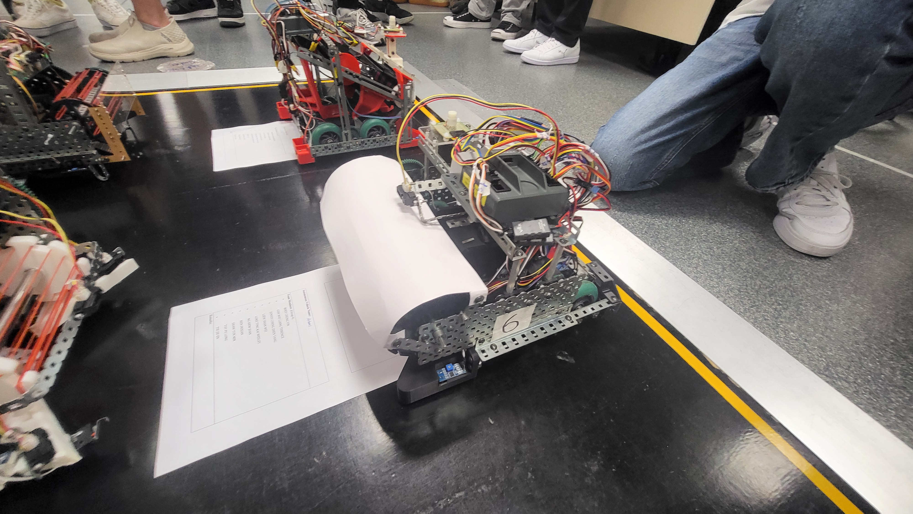
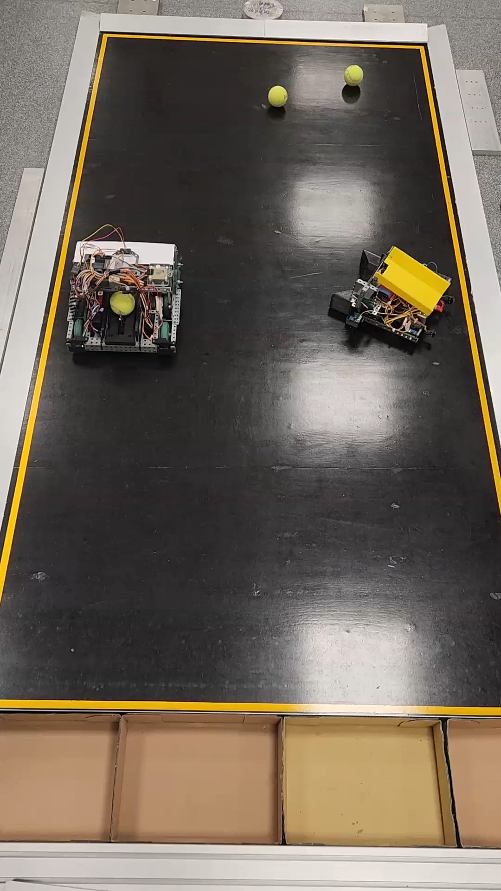

# autonomous-tennis-ball-collector
Autonomous tennis ball collector built for a competition setting.

The robot was designed using a combination of VEX components, 3D printed parts, and other sensors. It was programmed in RobotC IDE using C programming language.

  
   

### Competition objective
The goal of the competition was to collect more tennis balls than the opponent and delivery them back to the collection area while staying within the boundaries of the play area.

  
   

### Control system
The control of the robot is seperated into several functions that run in seperate threads. Task scheduling and synchronisation techniques were used to ensure that each thread were able to run properly when required.
